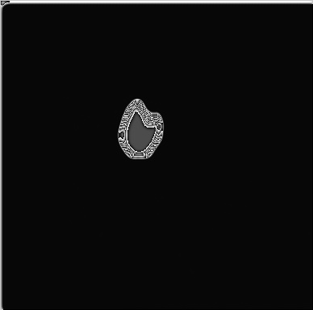

# Dose-Planning-Model
### This is a dose planning project

The simulator could be constructed with both cassifier and simulator, the desired work flow should be:
```
input->classification->simulation->result
```

Desired results:

`inputs`


`gropu1`

medicinal effects after 15 iterations:


medicinal effects after 20 iterations:



medicinal effects after 30 iterations:


`group2`

pure cell growth after 15 iterations:


pure cell growth after 20 iterations:


pure cell growth after 30 iterations:


